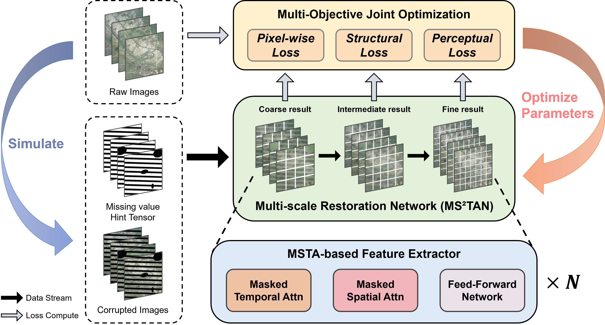

<div align="center">
  <h2><b> Multi-scale restoration of missing data in optical time-series images with masked spatial-temporal attention network (TGRS 2025) </b></h2>
</div>

<div align="center">

[[Paper]](https://doi.org/10.1109/tgrs.2025.3574799), [[arXiv]](https://arxiv.org/abs/2406.13358), [[Code]](https://github.com/CUG-BEODL/MS2TAN)

</div>

The official PyTorch implementation of the paper "Multiscale Restoration of Missing Data in Optical Time-series Images with Masked Spatial-Temporal Attention Network".

> MS$^2$TAN is named after **M**ulti-**S**cale **M**asked **S**patial-**T**emporal **A**ttention **N**etwork.

> MSMSTAN -> (MS)$^2$TAN -> MS$^2$TAN ✨️

<!-- **Since the original code implementation is rather messy, we will open the source code after organizing it. Please stay tuned for future updates.** -->

## Update

- 2025.9.30: We released the core code of the model.


## Quick view

The overall flowchart of the proposed method consists of two main components: a Multi-scale Restoration Network with MSTA-based Feature Extractors, and a ``Pixel-Structure-Perception'' Multi-Objective Joint Optimization method.

</img>

## Usage

```python
import torch
from models.network import *

device = "cuda"
num_frame = 10
num_channel = 6
img_size = 120

model = MS2TAN(
    dim_list=[256, 192, 128],
    num_frame=num_frame,
    image_size=img_size,
    patch_list=[12, 10, 8],
    in_chans=num_channel,
    out_chans=num_channel,
    depth_list=[2, 2, 2],
    heads_list=[8, 6, 4],
    dim_head_list=[32, 32, 32],
)
```

## Contact
If you have any questions or suggestions, feel free to contact me.

Email: zzaiyan@whu.edu.cn, zzaiyan@cug.edu.cn

## Citation
If you find our work useful in your research, we would appreciate your citation.

```
@article{zhang2025multi,
  author   = {Zhang, Zaiyan and Yan, Jining and Liang, Yuanqi and Feng, Jiaxin and He, Haixu and Cao, Li},
  journal  = {IEEE Transactions on Geoscience and Remote Sensing},
  title    = {Multiscale Restoration of Missing Data in Optical Time-series Images with Masked Spatial-Temporal Attention Network},
  year     = {2025},
  volume   = {63},
  pages    = {1-15},
  doi      = {10.1109/TGRS.2025.3574799}
}
```